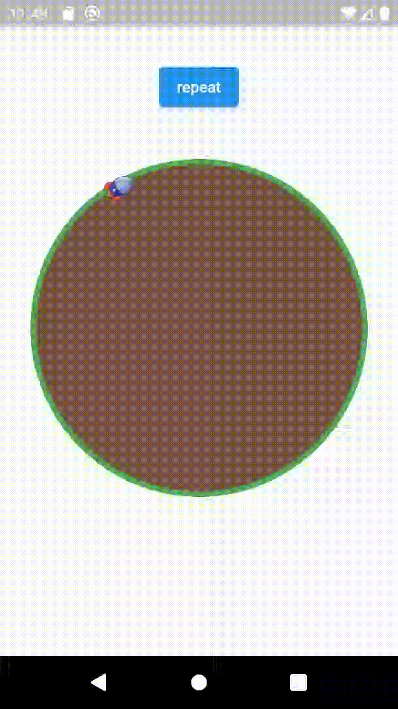

<!-- 
This README describes the package. If you publish this package to pub.dev,
this README's contents appear on the landing page for your package.

For information about how to write a good package README, see the guide for
[writing package pages](https://dart.dev/guides/libraries/writing-package-pages). 

For general information about developing packages, see the Dart guide for
[creating packages](https://dart.dev/guides/libraries/create-library-packages)
and the Flutter guide for
[developing packages and plugins](https://flutter.dev/developing-packages). 
-->


## Orbit

Make an object to orbit scaffold's center


## Features

* Set an object to orbit
* Set duration to complete one circle
* Set radius to the orbit
* Set a circle to be circled by the orbitting object (Optional)
* Start and stop the animation by manipulating repeat property
* Set initial rotation to the orbitting object
* Note that orbit is centralized, and cannot be flexibily positioned across the scaffold

## Usage

```

 Orbit(
   rotate: 10,
   repeat: true,
   completeDuration: Duration(seconds: 3),
   radius: 150,
   circle: Draw_Circle(arcColor: Colors.green, arcWidth: 5, radius: 150, circleColor: Colors.brown),
   child: Image.asset('images/rocket1.png',height: 30, width: 30))


```


## Parameters

Here are the accepted parameters :


| Name  | Type | Default Value | Description | 
| ------------- | ------------- | ------------- | ------------- | 
| completeDuration  | Duration | null  | Time to complete one circle  | 
| radius  | double | null  | Orbit's radius| 
| child  | Widget | null | The orbitting object| 
| circle  | Draw_Circle? | null | A circle that's circled by the object| 
| repeat | bool | true | Status of animation (Active/Unactive) | 
| rotate  | double | 0 | Object's initial rotation | 


## example



